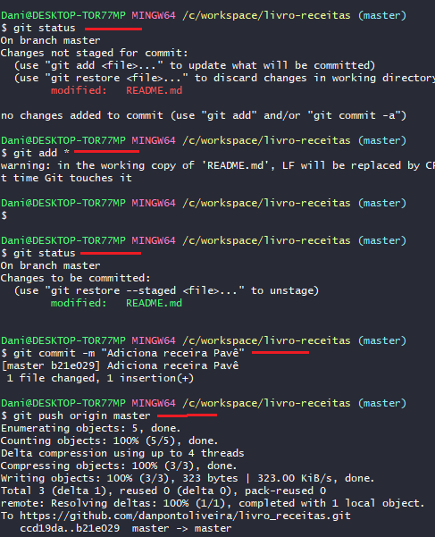

**INTRODUÇÃO AO GIT AO GITHUB**

**(Repositório de código)**

*\*Software não é feito sozinho, mas sim de forma colaborativa Ex.(Linux).*

***BENEFÍCIOS***

*1 – Controle de Versão*

*2- Armazenamento em nuvem*

*3 – Trabalho em equipe*

*4 – Melhorar seu Código*

*5 - Reconhecimento*

***COMANDOS BASICOS E NAVEGAÇÃO***

- ` `*Mudar de pasta*
- *Listar as pastas*
- *Criar pasta/arquivos*
- *Deletar pasta/arquivos*

` `*- Windows – CMD – comando (**dir+enter**)*

*Aparecerá a lista de diretórios do Windows*

*Linus – (**Ls+enter**)*

` `*- (**cd** /) – entrar nas pastas*

*(**Cd** Windows)*

*(**dir**) – todos os arquivos e pastas executáveis dentro desta pasta.*

*Para voltar – retroceder um nível (**cd**..)*

*Para limpar o terminal (**cls**)*

*\*Tab autocompleta o comando (atalho).*

***CRIAR PASTA -**  (**mkdir**) e nome da pasta = mkdir workspace*

*(**dir**) mostra os diretórios da pasta criada.*

*(**Cls**) – para limpar*

*(**cd** **wo+tab**) para completar o workspace*

*(**echo** **>** **hello.txt**) >direcionar*

***PARA DELETAR***

*(**del** **workspace**)*

*\*Porém, há uma diferença entre deletar arquivos e deletar repositório, esse comando só deleta os arquivos dentro do repositório.*

***ATALHO PARA NAVEGAR ENTRE O HISTORICOS DE COMANDOS***

***(seta para cima) acessar o texto para criar o arquivo***

***-Listar***

***-Retornar***

***-Limpar***

***Para remover o repositório usar o comando (rmdir workspace /S /Q).***

***REALIZANDO INSTALAÇÃO DO GIT:***

[Git - Downloads (git-scm.com)](https://git-scm.com/downloads)

-Assegurar que os check-box estejam marcados:

Windows:

Linux/Mac:

**COMO O GIT FUNCIONA POR DEBAIXO DOS PANOS:**

-SHA1 – Secure Hash Agorithm (Algoritmo de Hash seguro) \* encriptação.

-Objetos fundamentais

-Sistema distribuído

-Segurança

\*A encriptação gera conjunto de characters identificador de 40 dígitos.

Ex. utilizando no Desktop, clicar com o botão direito e abrir o ‘gitbash here’

(openssl sha1 nome do arquivo.txt)

Chave ex. criado: 80c625a2d975956uucbcc7c28017f27b66f0e69

Qualquer alteração no arquivo, altera o código de identificação (chave).

**OBJETOS FUNDAMENTAIS:**

- BLOBS
- TREES
- COMMITS

**\*BLOBS**:

***\*\****

*Para que a chave continue a mesma:*

***\*TREE**:*

***COMMIT**:*

*(Mais importante)*

*- Forma segura de demonstrar que o arquivo, foi inalterado, pois toda alteração gera uma nova chave (garante a autenticidade).*

*\*Sistema Distribuído Seguro\**

***CHAVES SSH E TOKENS:***

*CHAVE SSH –* 

*- Entrar no Github  - Settings – Chave SSH Keys*

*-  Entrar no Git bash (maquina) e seguir a sequencia de comandos:*

*(ssh-keygen -t ed25519 -C e-mail usando no github)*

(/c/Users/Dani/.ssh/id\_ed25519):

Cadastrar senha: xxxx0x0x0x

SHA256:0000000xxx0x0x0x0x0x0x0x0x0xx+/0x0x0x xxxxx@e-mail.com

The key's randomart image is:

+--[ED25519 256]--+

|   o===\*\*+..     |

|  .. o=\*=\*=o     |

|    . o=\*+B.+    |

|   o . +.B.  o   |

|  . . o S o .    |

|     .     o     |

|      E   . .    |

|     .  .o . .   |

|      o+. . ...  |

+----[SHA256]-----+

*Localizar as chaves pública e privada*

*(cd /c/Users/Dani/.ssh/)*

*(cat* id\_ed25519.pub)

Chave pública – salvar no GitHub

ssh-ed25519 0000000xxx0x0x0x0x0x0x0x0x0xx+/0x0x0x <xxxxx@e-mail.com>

*- (ls) no git bash – para verificar aonde esta*

*- (pwd) mostra o caminho completo*

*- (*eval $(ssh-agent -s) – para criar o agente pid ‘1219”

*- (*ls) 

*- (*ssh-add id\_25519) – passar para o agente a chave privada, após digitar a senha

\*Clonar o code pelo SSH

(git clone) colar o link ssh.

**CONFIGURAR UMA CHAVE PARA ACESSO REMOTO**

Token de acesso Pessoal:

**gfg\_qK3Dc8Kcc3aB500f5d85ffcffksOJCJ6ukHNf00AeV0h1**

\- Para criar, **settings** – **Developer** **settings** – **Personal** **Acess** **tokens** – **generate** **new** **token**, pode inserir um prazo para expirar – opção **repo** (atende) – **generate** **token**

Pode ser usando o url em HTTPS, para clonar

\*\*Passo a passo se aplica para maquinas que não sejam de confiança, se é máquina é sua, o passo anterior atende.

**PRIMEIROS COMANDOS COM O GIT**

-Iniciar o GIT

-Iniciar o versionamento

-Criar um commit

Início dos códigos

- \*Git init
- \*Git add
- \*Git commit

\- Abrir a pasta workspace criada pelo git bash, abrindo a pasta c: do Windows, clicando com o botão do direto já vai direto para o repositório da pasta:

Após criar a pasta lista-receitas, dentro da workspace

(git init) – o comando (ls) não vai lista a pasta, pois ela é oculta para os códigos-

O comando a ser usando é o (ls -a):

*Voltar com o (c ..), limpar (crt+l)*

*Configuração inicial necessária:*

(git config --global user.email <e-mail@e-mail.com>)

(git config --global user.name [dsoliveira](mailto:danpontoliveira@gmail.com))

*- **Adicionado um arquivo**:*

*Markdown*

*Baixar o app Typora (leitor de Markdown)*

*# espaço e o titulo*

*(: escrever o emoticon, é possível inserir*

*Criar \* espaço-1 espaço*

*-Após formatar o arquivo, necessário commitar com os dados infra:*

*Resultado com sucesso:*

***CICLO DE VIDA DOS ARQUIVOS DENTRO GIT***

*COMMIT- move os arquivos do staging para unmodified*

*\*tudo que está no repositório tem que estar commitado, para constar no repositório remoto (GitHub).*

*\*\*Comando no Git para verificar status dos arquivos, se estar untraking, unmodified, etc..*

*(git status):*

*------*

*(mkdir nome da pasta “receitas”) – criando outra pasta*

*(mv nome da pasta.md ./a pasta para qual deseja mover/ “Strogonoff.md ./receitas/”) – para mover a pasta:*

*- Quando não localiza:*

*\*\**

*-Movendo a pasta e commitando: *

*-O Comando (git add \*), adiciona todos as modificações para a stage (anterior ao palco, ‘entrar em ação’) *

***TRABALHANDO COM O GITHUB:***

*-Verificar se as informações no Git estão iguais ao GitHub para fácil comunicação entre eles*

*(git config –list)*

*\*Se necessário alterar usar o comando (git config –global –unset user.name “o que precisa ser corrigido”)*

*\*\*Pata configurar após apagar, basta utilizar o mesmo código, sem o “unset” (git config –global user.name “o que precisa ser corrigido”)*

*Ex.:*

*ADICIONANDO REPOSITÓRIO*

*-Neste caso em especifico, deixaremos o “README” desmarcado, pois já adicionamos no repositório local:*

*-Copiar o URL para inserir no repositório local:*

*-Código no Git para adicionar ao repositório remoto:*

*Traz a lista de repositórios cadastrados:*

*\*\*“origin” é apenas um alias(apelido) por convenção para não ter que ficar digitando a url novamente,*

*- Agora iniciar o push, para empurrar o código:*

*- Autenticar no GitHub:*

*\*\*O GitHub sempre irá procurar um arquivo markdown*

***RESOLVENDO CONFLITOS:***

***(conflitos de merge)***

*Passo a Passo para alterar o arquivo readme.md e atualizar no GitHub:*

*\*Código para puxar a versão do GitHub e comparar ambas:*

*(*git pull origin master)

Após verificar qual esta certo e atualizada:

*(*git commit -m “resolve conflitos”)

Após resolver conflito e commitar, enviar novamente ao repositório:

*(*git push origin master)

**CRIANDO LINK NO GITHUB:**

